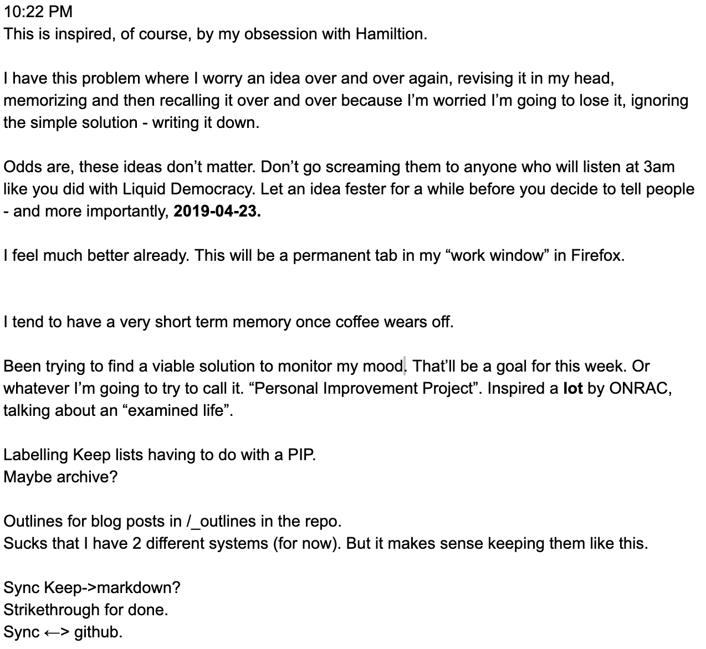

# The Receptive Machine
###### *Or, how to get your ideas out of your head so you can finally go to sleep.*

Disclaimer: This post may be pretty obvious advice, and may have been written by someone more authoritative already. But I wanted to explain a simple system I started practicing that helped me record my ideas and feelings, and thus helped reduce a mental habit I didn't know existed that was occupying a lot of my mental capacity and causing anxiety as a result.

I've since continued to develop this "system", with a focus on low-commitment self-analysis I think would be helpful for a lot of people. This is the lowest-commitment approach - the first rung on the ladder. While it's useful by itself, I will continue this series with progressively more helpful and lower-effort ways I found to better understand myself and organize my life.

I've been talking constantly to friends and family members about these methods, and figured it was time to put it one place in hopes it helps others as well!

# The problem

### **I'm an *ideas* guy, maaaan. I think big picture. I just need you to turn my ideas into an app.**
###### *- some sales douche, probably.*

*To keep things simple, you can substitute "how I'm feeling now/things I have to do/funny story about what happened today" for "idea" when reading this. The same problem exists for these things.*

I love ideas, but they're often given a bad rap. Ideas are exciting, but implemention is *work*. And it's work that turns those ideas into reality. Most ideas don't make it through the birthing process, and end up spending their existences incorporeal, haunting their creators with dim memories of once-cherished dreams.

But ideas are fun. Fun to think about, fun to dream about when you don't have the brainpower for more important things. Fun to turn over in your mind when you aren't doing anything else. Like, say, trying to sleep.

Ideas are so much fun that they contribute to my insomnia. I spend a lot of time sort of "whittling" an idea down in my head, resolving it, imagining what it would be like.
All day, but particularly when it gets later at night, I start to worry that I'll forget some aspect or philosophy of an idea if I fall asleep, and that's enough to keep me running it over and over in my head, keeping me awake.

And I love sleep.

Most of my ideas are nonesense. Still, the rare times I would write them down, I'd get bogged down trying to organize fractions of half-finished thoughts into a narrative that stood a chance of ever making sense to anybody. Rearranging the structure and wording of sentences only I would see.

Even worse, almost every time the muse would strike, it did so while I was doing something else. Opening up a notebook or input-heavy app to write coherent sentences was usually *far* too distracting or time-consuming to justify interrupting whatever I was doing. This would cause me to either quickly forget the idea or obsessively think about it.

I thought about these things over and over, both to perfect them in my mind and memorize them in hopes that I wouldn't lose them.

Eventually one of these ideas was about, coincidentally, how to stop worrying about these ideas without much overhead. What follows is that simple meta-idea that has begun to lessen the cognitive load of this problem.

# The (partial) solution

### Think of your stream of consciousness as your "native language".

Our minds don't think in paragraphs, or sometimes even sentences. Brains are massively parallel, and at any time can be thinking about multiple ideas, plans, and emotions at the same time. One of the difficulties of writing down an idea/story/etc is that it requires us to "translate" between this disorganized, concurrent mess into something that makes sense organizationally in our language of choice.

### Translation from your native language takes time

Often too much time, given that we're usually doing something else when ideas pop into our heads. However, if we were to write things down in our "native language" - full of sentence fragments, out-of-order descriptions of the ideas mixed with emotions, stories, and anything else we wanted to remember, it would take us much less time to register the thought, while mitigating the fear of losing it. This frees up our mind to focus on other things besides the idea throughout the day, and significantly reduces our cognitive load.

### Translation can be separated from recording the thought, and actually fun

...when you actually dedicate time to it.

It lets you think about the idea again and really enjoy it, because it's not interrupting other tasks. It lets you throw away the ridiculous ones, and organize the good ones into a cohesive unit. This unit may not be a complete description yet, but at least an organized one.

This blog post is an example of this process in action. I first wrote about it (and a million other things) in a fast "stream of consciousness" form that made me look like the [time cube guy](http://timecube.2enp.com) (although with no formatting, which is important). Later I dedicated some time to translating and organizing this idea, which even later finally became reality.

